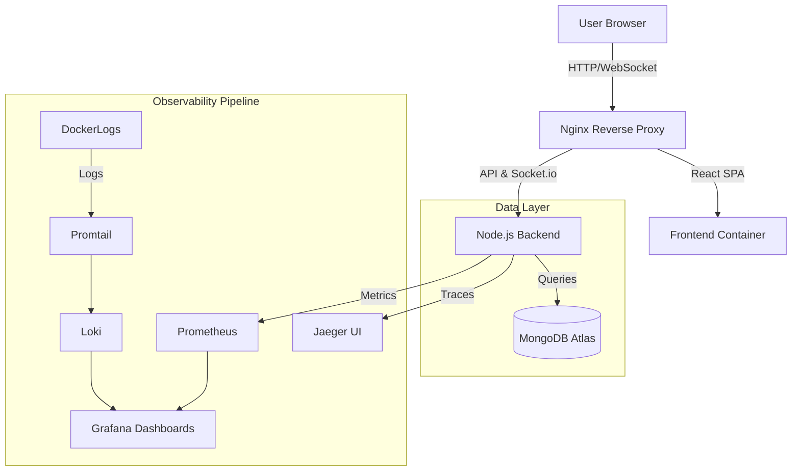

# Baya: Real-Time Polling Platform with Full-Stack Observability


Baya is a production-ready, containerized polling application engineered to demonstrate **Microservices Orchestration**, **Real-Time Communication**, and **Deep Observability**.

Unlike standard full-stack applications, Baya features a custom-built telemetry pipeline (**"The Glass Box"**) that visualizes request latency, traces database operations, and centralizes logs without relying on paid third-party vendors.

---

## 🏗 System Architecture

The application is fully containerized using **Docker Compose** to orchestrate seven distinct services.


## The Stack

* **Frontend:** React (Vite) served via **Nginx** (Custom configuration for SPA routing & Reverse Proxy).
* **Backend:** Node.js (Express) with **Socket.io** for real-time bidirectional events.
* **Database:** MongoDB (Atlas) for persistent storage.
* **Observability Pipeline:**
  * **Tracing:** OpenTelemetry (OTLP) → **Jaeger** (Visualizing request flows).
  * **Metrics:** Prometheus (Scraping system health) → **Grafana** (Dashboards).
  * **Logs:** Promtail (Log shipping) → **Loki** (Log aggregation).

---

## 🛡️ DevSecOps Pipeline

Security is shifted left into the CI/CD lifecycle. The pipeline enforces a strict **"block on critical"** policy using GitHub Actions.

| Layer | Tool | Purpose |
| :--- | :--- | :--- |
| **1** | **Gitleaks** | Prevents API keys and credentials from entering git history |
| **2** | **CodeQL** | Performs SAST analysis (e.g., NoSQL injection detection) |
| **3** | **Trivy (FS)** | Scans npm dependencies and OS packages for known CVEs |
| **4** | **Trivy (Image)** | Scans Docker images and blocks builds on critical vulnerabilities |
| **5** | **Checkov** | Audits Dockerfiles and infrastructure code for misconfigurations |

---

## 🚀 Quick Start (One-Command Setup)

You do not need Node.js or MongoDB installed locally. **Docker** is the only requirement.

### 1. Clone the repository
```bash
git clone [https://github.com/donfortune1/baya-backend.git](https://github.com/donfortune1/baya-backend.git)
cd baya-backend

```

### 2\. Create Environment File

Create a `.env` file in the root directory:

Code snippet

```
PORT=3000
MONGO_URI=your_mongodb_atlas_connection_string
JAEGER_ENDPOINT=http://jaeger:4318/v1/traces

```

### 3\. Launch the Infrastructure

Bash

```
docker-compose up -d --build

```

### 4\. Access the Services

-   **App (Frontend):** [http://localhost:5173](https://www.google.com/search?q=http://localhost:5173)

-   **Jaeger (Tracing):** [http://localhost:16686](https://www.google.com/search?q=http://localhost:16686)

-   **Grafana (Dashboards):** [http://localhost:3005](https://www.google.com/search?q=http://localhost:3005)

-   **Prometheus:** [http://localhost:9090](https://www.google.com/search?q=http://localhost:9090)

* * * * *

🕵️‍♂️ "The Glass Box": Observability
-------------------------------------

Baya implements **OpenTelemetry** to provide full transparency into the backend's behavior.

### 1\. Distributed Tracing (Jaeger)

Every API request is traced from the controller layer down to the MongoDB query.

-   **How to test:** Vote on a poll in the UI.

-   **See the trace:** Go to Jaeger, select `baya-api`, and click "Find Traces." You will see the exact execution time of the MongoDB operation and the Socket.io broadcast event.

### 2\. Centralized Logging (Loki)

Logs are not trapped inside containers. **Promtail** tails the Docker container logs and ships them to **Loki**, making them queryable in Grafana alongside metrics.

* * * * *

🧠 Engineering Highlights
-------------------------

### Solved: The "SPA Routing" Problem

-   **Challenge:** React Router works client-side, but refreshing `/dashboard` in a standard Docker container throws a 404 Nginx error.

-   **Solution:** Configured a custom `nginx.conf` with a `try_files $uri /index.html` directive to ensure Nginx hands control back to React for unknown routes.

### Solved: Container Networking & Telemetry

-   **Challenge:** The Backend service could not communicate with the Jaeger container due to isolated Docker networks (`ECONNREFUSED`).

-   **Solution:** Architected a unified bridge network in `docker-compose` and implemented dynamic environment variable injection (`JAEGER_ENDPOINT`) to allow the Node.js process to discover the tracing service via Docker DNS.

* * * * *

📦 Automated Releases & Versioning
----------------------------------

This project follows **Semantic Release** principles to automate versioning and changelog generation.

-   `fix: <message>` → **Patch release** (v1.0.0 → v1.0.1)

-   `feat: <message>` → **Minor release** (v1.0.0 → v1.1.0)

-   `BREAKING CHANGE: <message>` → **Major release** (v1.0.0 → v2.0.0)

**Synchronization Guarantee:** Every Git tag has a one-to-one mapping with a Docker image tag, ensuring complete artifact traceability.

* * * * *

🚀 Future Improvements & Roadmap
--------------------------------

While the current pipeline implements robust DevSecOps practices, plans to further scale the architecture include:

-   **Centralized Vulnerability Management:** Integrate **DefectDojo** to aggregate findings from Trivy, CodeQL, and TruffleHog.

-   **Dynamic Application Security Testing (DAST):** Implement **OWASP ZAP** to run active penetration tests against staging.

-   **Kubernetes Deployment:** Migrate from Docker Compose to **Helm Charts** and **ArgoCD** for GitOps-based delivery.

* * * * *

📜 License
----------

MIT